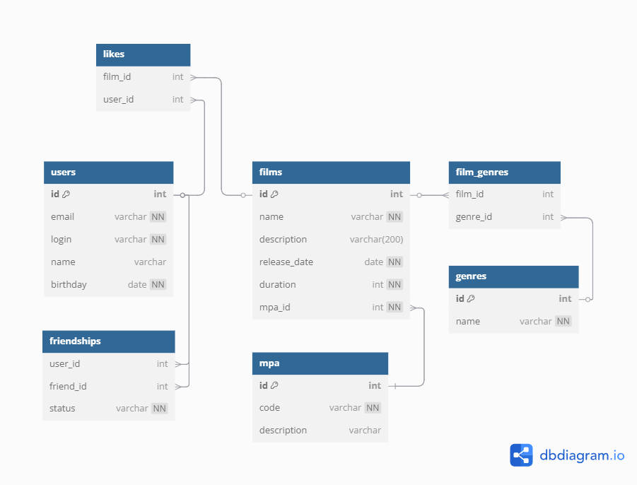

# 🎬 Filmorate

**Filmorate** — это социальный сервис для любителей кино. Пользователи могут оценивать фильмы, добавлять их в избранное, дружить друг с другом,
а также находить популярные фильмы и общих друзей.

---

## 📊 Схема базы данных



Схема реализована в соответствии с нормальными формами (1NF–3NF), поддерживает все бизнес-требования и расширяема под подключение SQL-базы данных.

---

## 📝 Пояснение к схеме

| Таблица         | Описание |
|------------------|----------|
| `users`          | Пользователи сервиса |
| `films`          | Фильмы |
| `mpa_ratings`    | Возрастные рейтинги MPA (G, PG, PG-13, R, NC-17) |
| `genres`         | Жанры фильмов |
| `film_genres`    | Связь фильмов и жанров (многие-ко-многим) |
| `film_likes`     | Лайки фильмов от пользователей |
| `friendships`    | Дружба между пользователями со статусами (`CONFIRMED`, `UNCONFIRMED`) |

---

## 📚 Особенности бизнес-логики

- Фильм может принадлежать нескольким жанрам.
- Возрастной рейтинг задаётся по классификации MPA (отдельная таблица).
- Пользователь может отправить запрос в друзья, который необходимо подтвердить.
- Лайки пользователей используются для формирования топа популярных фильмов.

---

## 🧪 Примеры SQL-запросов

```sql
-- Топ-10 самых популярных фильмов по количеству лайков
SELECT f.id, f.name, COUNT(fl.user_id) AS likes
FROM films f
JOIN film_likes fl ON f.id = fl.film_id
GROUP BY f.id
ORDER BY likes DESC
LIMIT 10;

-- Найти общих друзей двух пользователей
SELECT u.*
FROM friendships f1
JOIN friendships f2 ON f1.friend_id = f2.friend_id
JOIN users u ON u.id = f1.friend_id
WHERE f1.user_id = 1 AND f2.user_id = 2
  AND f1.status = 'CONFIRMED'
  AND f2.status = 'CONFIRMED';

-- Получить все фильмы с жанром «Драма»
SELECT f.*
FROM films f
JOIN film_genres fg ON f.id = fg.film_id
JOIN genres g ON fg.genre_id = g.id
WHERE g.name = 'Драма';

-- Фильмы с возрастным рейтингом PG-13
SELECT f.name, r.name AS rating
FROM films f
JOIN mpa_ratings r ON f.mpa_rating_id = r.id
WHERE r.name = 'PG-13';

-- Пользователи, у которых нет друзей
SELECT u.*
FROM users u
LEFT JOIN friendships f ON u.id = f.user_id
WHERE f.friend_id IS NULL;
